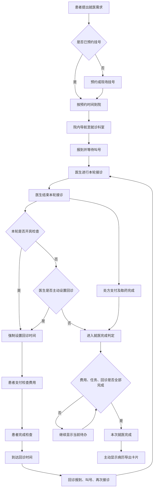

# 医院导诊 Agent 产品文档

## 1. 基本信息

| 项目     | 内容                                                                          |
| -------- | ----------------------------------------------------------------------------- |
| 产品名称 | 医院导诊 Agent                                                                |
| 产品理念 | 不要让城市的语言阻碍城市功能的实现                                            |
| 产品形态 | 对话式 Agent + 多方医院系统                                                   |
| 数据来源 | 绵阳市中心医院                                                                |
| 核心用户 | 50～70 岁、来自县域或农村、首次或低频前往城市三甲医院的患者及协助其就医的家属 |

### 产品简介

本产品是部署于单家医院内部的全流程导诊 Agent。它以自然语言对话为统一入口，理解患者当前想解决的问题，结合医院科室、号源、地点和就诊状态，为患者推荐可能适合的科室，并持续推动挂号、到院、报到、候诊、缴费、检查、回诊和取药等任务。

## 2. 场景洞察

### 2.1 核心洞察：医院的语言构成了就医门槛

和很多其它三甲医院一样，绵阳市中心医院已经实现了包含:

- 官网/小程序、自助机[（官网网址）](https://www.myszxyy.cn/guider/)
- 患者助手Agent[（Chatbot网址）](http://rgzn.myszxyy.cn:11466/chatbot/0YJDV5NTxJd3Uwuj)

的智能化服务，且服务智能水平明显高于三甲医院的平均水平（这一点将在竞品分析处论证）。

但这些能力**入口不同，术语专业，步骤离散**。而就医流程是一个**长链条、多场景**的流程。对于教育水平不高、健康素养不足或不熟悉城市医院就诊流程的患者有以下痛点：

- 不知道当前问题对应哪个服务；
- 不理解系统和工作人员使用的术语；
- 不知道一项操作完成后下一步是什么；
- 无法把不同设备、窗口、楼栋和业务连接成完整流程。

预约成功、挂号成功、待缴费、待取号和待报到在医院系统中是不同状态，但在用户理解中可能都只是“号挂好了”；建档、取号、报到、收费和医保审核具有不同业务含义，但对用户而言都只是“办手续”。这种语言和认知差异使已有医院能力难以被目标用户轻松使用。

### 2.2 目标场景

目标用户通常具有以下特征：

- 50～70 岁；
- 来自县域或农村；
- 初中及以下文化程度，可能使用方言或非专业表达；
- 首次或低频前往城市三甲医院；
- 有智能手机、能使用微信语音、扫码等功能，但难以独立完成复杂流程；
- 可能由中年家属陪同。

政府统计数据表明，城乡居民健康素养存在差距，老年人、农民和识字较少人群的健康素养尤其有限[（研究来源）](https://www.nhc.gov.cn/xcs/c100122/202601/b96a86ec961c46de9036bf85901d84a9.shtml)；与此同时，进城农民工家庭的互联网可及率已经较高[（研究来源）](https://wjw.gz.gov.cn/xxgk/wgk/jggk/content/post_10048699.html)。这意味着目标用户并非无法接触数字产品，而是现有数字产品的语言、步骤和交互方式没有充分适配他们。

### 2.3 目标人群的就医痛点

#### 到院前：不知道该选择什么

- 分不清预约挂号、智能导诊、在线咨询和互联网复诊；
- 不理解普通门诊、专家门诊、专病门诊和亚专科的区别；
- 只能描述身体部位、感受和症状（甚至是方言），无法匹配专业科室和医生方向；
- 不知道应携带哪些证件、凭证和资料；
- 不理解停诊、爽约、退号和报到截止时间等规则。

#### 到院后：知道目的，但不会执行

- 分不清门诊、急诊、住院部及不同院区；
- 不知道应该去建档、挂号、报到、收费还是医保窗口；
- 自助机文字密集，身份凭证和医保方式选择复杂；
- 工作人员的指令简短，且无法实现跟随，不同工作人员又无法即时共享患者信息；
- 患者与家属分开后，流程状态无法同步。

#### 院内移动：路线与任务顺序同时复杂

- 检查单、标牌和口头指引可能对同一地点使用不同名称；
- 多楼栋、连廊、楼层、分区和诊室号需要同时理解；
- 相对方向指令依赖起点和方向记忆，中途走错后难以恢复；
- 缴费、预约、采血、影像检查和回诊之间存在前后依赖，找到地点不等于流程正确。

#### 就诊后半程：状态和费用更容易混淆

- 挂号、检查、治疗和药品会分别产生缴费任务；
- 已缴费不等于已预约检查，医保结算成功也不等于无需自付；
- 取消检查可能同时涉及医院退费和医保撤销；
- 不知道去哪个药房、是否缺药，以及哪些材料需要留存。

### 2.4 次要但普遍的问题：等待时间与非临床服务体验

**就医流程连续性和引导主动性是本产品首先需要解决的核心问题。**在此基础上，产品还应关注患者在真实门诊中的等待时间和非临床服务体验，并通过状态透明、主动提醒和路径编排降低不确定感。

就诊耗时不存在适用于所有患者的单一结论：普通门诊通常以等待医生接诊耗时最长；需要检验或影像检查时，“预约检查—等待检查—等待结果—返回医生”可能成为最长环节。福建一家省级三级综合医院的研究中，繁忙科室患者等待接诊平均为 57±30 分钟，等待取药平均为 34±19 分钟，而医生实际接诊约 5 分钟。该结果说明，患者的大部分时间可能消耗在服务之间的等待，而不是实际诊疗。
[（研究来源）](https://pmc.ncbi.nlm.nih.gov/articles/PMC5568260/)

2020 年上海市公立医疗机构门诊调查显示，在认为等候时间需要改善的患者中，59.24% 认为最需要改善候诊时间。全国“进一步改善医疗服务行动计划”第三方评估以及北京某三级医院调查也将就诊等待时长、候诊秩序、挂号排队、导诊服务和候诊环境列为相对薄弱项目。[（上海调查）](https://html.rhhz.net/ZGWSZY/html/2022-2-160.htm) [（全国第三方评估）](https://rs.yiigle.com/CN111325202106/1331847.htm) [（北京三级医院调查）](https://rkyfz.pku.edu.cn/Article/info?aid=387443909)

因此，产品将以下问题列为需要持续解决的次要问题：

- 告知患者当前处于哪个环节、前方还有哪些任务，降低未知等待带来的焦虑；
- 在医院提供实时队列数据后，展示预计等待时间、排队进度和过号风险；
- 根据任务依赖和地点顺序编排流程，减少无效往返和重复排队；
- 在等待异常、检查设备故障、停诊或位置变化时，及时给出替代方案和人工服务位置；
- 使用短句、大字号、明确的单一主操作，改善中老年患者对导诊信息和数字入口的使用体验。

产品可衡量的指标是等待信息透明度、无效等待和往返时间、流程错误的比例。后续阶段，产品可统计以上信息并将真实瓶颈反馈给医院管理者。

## 3. 用户需求

### 3.1 患者侧需求

1. **低理解成本**：使用日常语言、短回复、大字号、少选项和单一主要动作。
2. **结果明确**：每次回答优先说明“现在是什么状态、下一步做什么、去哪里”。
3. **流程连续**：不要求用户记忆此前步骤，允许从任意阶段发起对话。
4. **操作闭环**：不仅告诉用户如何办理，还应主动调用医院工具完成可执行业务。
5. **信息可靠**：科室必须来自医院官方目录；地点冲突以医院地图为准；动态信息无法确认时明确说明。

### 3.2 医生侧需求

1. 降低强确定性和结构化信息的问询成本，提高有效诊断时间比例。

### 3.3 医院侧需求

1. 提高就诊透明性，降低业务信息收集成本；
2. 提高接诊运转效率，降低接诊人力成本。

## 4. 产品定位

### 4.1 一句话定位

**面向中老年患者的单院全流程智能导诊入口，帮助用户在连续的语音对话中推进各个就医步骤。**

### 4.2 产品价值

#### 对患者

把专业术语、复杂菜单和分散服务转换成当下可理解、可执行的一步，降低错误挂号、重复排队、走错地点和遗漏任务的概率。

#### 对医院

降低服务成本，提高资源利用效率；
减少医患冲突；
提高就医服务规范性和可分析性。

#### 对医生

将患者主动表达在后台同步整理为可追溯的就诊信息，帮助医生更快了解患者目的，同时保证医生对医学内容的最终权威。

### 4.3 国家卫生健康行业人工智能应用场景依据

国家卫生健康委办公厅、国家中医药局综合司、国家疾控局综合司于 2024 年 11 月 6 日联合印发《卫生健康行业人工智能应用场景参考指引》（国卫办规划函〔2024〕420号）[（附件）](https://www.nhc.gov.cn/guihuaxxs/c100133/202411/3dee425b8dc34f739d63483c4e5c334c/files/1733227133524_47343.pdf)。该文件提出医疗服务管理、基层公卫服务、健康产业发展和医学教学科研等 4 个方面、13 个小类、84 项应用场景，为卫生健康行业“人工智能+”应用创新提供参考方向。

本产品已经实现的基础能力与《参考指引》中以下场景直接相关：

| 《参考指引》条目      | 文件中的应用方向                                                                                             | 本产品对应能力                                                                                                                               |
| --------------------- | ------------------------------------------------------------------------------------------------------------ | -------------------------------------------------------------------------------------------------------------------------------------------- |
| 第 8 项：智能门诊分诊 | 诊前通过图文或语音交互采集症状和病史，结合医学知识与医院分诊场景推荐就诊科室和医生                           | 患者使用文字描述不适；系统从绵阳市中心医院完整官方科室中召回候选，调用 DeepSeek 输出结构化推荐，再经过科室 ID、Schema 和业务规则校验         |
| 第 9 项：智能就医咨询 | 识别患者就医需求，基于医学和就医服务知识提供流程、注意事项等信息，并可关联其他在线服务主动提供入口           | Agent 基于医院知识库回答挂号、报到、候诊、缴费、检查、回诊、取药及院内地点问题；结合当前业务状态说明下一步，并调用挂号、就诊状态、地点等工具 |
| 第 10 项：智能预问诊  | 在医生接诊前、患者等候就诊时采集患者主动提供的症状、现病史、既往史等信息，整理成可供医生参考的结构化病史资料 | Agent 在不打断患者主线的情况下引导患者补全信息；直接写入病历供医生参考                                                                       |
| 第 11 项：智能陪诊    | 在就诊全过程主动提供流程、时间、地点、候诊、缴费、取药和导航等提醒与服务                                     | 系统维护患者当前就医阶段，展示当前状态和下一步任务；支持号源与挂号、就诊任务、账单指引、地点搜索、院内地图和静态路线说明                     |

本产品方向与国家卫生健康行业人工智能应用场景具有一致性。

## 5. 业务流程

### 5.1 当前实现范围与角色入口

当前系统已经形成相互隔离的患者端、医生端、管理员端和地图页：根地址自动进入 `/user`，医生、管理员和地图分别使用 `/doctor`、`/admin`、`/map`。页面不再通过参数切换身份。患者无需注册账号或登录，浏览器通过受保护的会话保存本次就医状态；医生需要使用六位工号和不少于八位的密码登录；新注册医生须由演示系统管理员审核激活后才能登录和发布出诊安排。管理员审核只表示账号获准进入本演示系统，不代表医院对医生真实身份、资质或劳动关系进行了认证。

本系统尚未与医院挂号、支付、排队、电子病历、PACS、LIS 或药房系统连接。因此，运行时产生的号源、挂号、队列、账单、检查、处方、回诊和完成状态均为演示系统业务数据；患者点击支付不会调用第三方，也不会产生真实扣款。医院名称仅用于说明公开信息来源，所有页面底部均说明信息来源及“非医院官方服务”。

### 5.2 患者交互与 Agent 单轮链路

患者端只保留一个主要对话界面。文字输入每轮最多 500 字；患者消息提交后立即显示，页面刷新或产生新消息后自动滚动到最新内容。系统同时支持讯飞语音转写和讯飞语音合成：语音先转成文字再按同一链路提交，Agent 回复默认自动朗读，患者可在页面上方关闭朗读。文字回复采用流式展示，以降低等待感。

一轮对话按下列顺序处理：

模型不会直接接收全部历史对话。输入由当前一句话、性别与年龄、已经确认的结构化就诊事实、不超过 240 字的会话摘要、当前阶段、当前待办和允许的意图组成，不包含姓名和身份证号。模型输出包括意图、是否已处理、置信度、简短回答、实体、最多四项待记录事实、是否需要人工帮助，并被强制标记为“不包含诊断”。服务端再依据模型结果和真实业务状态决定是否展示工具卡，模型本身不能直接写挂号、账单、医嘱或病历。

Agent 回复使用“姓氏＋先生/女士”称呼患者。回答优先使用短句和单一主操作，不直接展示长列表；完整科室等长数据通过二级选择器打开。工具卡只出现在该轮文字回复结尾。患者临时询问医生、地点或自己的挂号、药品、检查信息时，Agent 先完成临时任务；问题解决后重新显示此前尚未完成的当前任务。

### 5.3 Agent 工具与确定性操作

当前 Agent 可编排的能力如下。查询工具可直接读取数据；会改变业务状态的操作由服务端校验，必要时要求患者在工具卡中点击或再次确认。

| 能力类别     | 当前已实现的能力                                                                                            |
| ------------ | ----------------------------------------------------------------------------------------------------------- |
| 科室与医生   | 结构化科室推荐；按医生姓名或科室检索医生；查询指定日期或近期出诊医生                                        |
| 患者业务查询 | 查询本人的挂号、处方、检查或全部就医记录；读取并重新显示当前任务                                            |
| 挂号与退号   | 展示建档表单、号源和挂号确认；创建挂号；拦截同一患者同一天重复挂同一科室；在允许状态下退号                  |
| 就诊推进     | 挂号费模拟支付、报到、候诊、医生叫号、开始接诊、检查/药品费用模拟支付、确认完成检查、确认完成取药、回诊报到 |
| 地图与资料   | 提供地图页入口、地点检索和路线规划；就医完成后导出病历摘要                                                  |
| 安全与恢复   | 模拟呼叫护士；准备、确认或取消“撤回上一轮对话”                                                              |

医生注册、审核、发布出诊、叫号、编辑病历、创建或撤销医嘱、填写检查结果和结束接诊由各自角色页面中的确定性业务接口完成，不交给大模型自由生成。

### 5.4 科室推荐与医生检索

科室推荐覆盖离线知识库中的全部可导诊临床科室，流程为“用户口语描述→候选科室召回→形成候选白名单→DeepSeek 输出结构化结果→Schema、科室 ID 和置信度校验→推荐一至两个科室或提出一个区分问题”。模型不能推荐白名单外的科室，也不能把科室建议表述成疾病诊断；模型不可用或输出无效时，系统只给出保守说明和澄清问题，不按目录顺序随意推荐。

医生检索使用离线整理的医院公开医生资料，支持按姓名、按科室以及按日期查询。医生简介和所属科室来自公开知识；当前出诊日期来自明确标注的演示排班参考，不是医院实时号源。真正可挂号的号源只取自本演示系统中已激活医生发布的出诊记录，并过滤行政后勤等不可挂号科室。

当前实现已具备结构化契约校验、越界降级和自动化测试，但尚未使用医院真实标注病例完成临床准确率验证。因此，本版本不能声称已经达到医学分诊准确率目标；后续仍应分别评估 Top-1 准确率、Top-2 召回率、全科室宏平均召回率、补问正确率、不当强推率和越界输出率。

### 5.5 挂号、候诊与接诊

1. 患者可在未建档状态下咨询科室、医生、流程和地点；只有确认挂号时才强制填写基本资料。
2. 姓名和身份证号必须在对话末尾弹出的表单中手工填写，不能由自然语言自动代填；系统根据身份证号识别性别和年龄，但患者主界面不额外展示这些字段。
3. Agent 展示不超过必要数量的推荐科室、医生、日期、时间和费用。患者确认后创建演示挂号及挂号费账单；模拟支付完成后挂号进入可报到状态。
4. 同一患者同一天已有同科室的有效挂号时，系统返回原挂号信息，不再重复占用号源；号源已满时说明无号，并提供可用替代时间或医生，不伪造成功。
5. 患者报到后进入候诊。Agent 主动以每轮一个问题的方式询问病情，但回答患者问题始终优先，信息收集不会阻断主流程。患者主动表达的主诉、症状、时间线、既往情况、用药、过敏和关注问题被结构化写入同一份病历草稿。
6. 医生在工作台叫号后，患者端收到“请前往就诊”的主动提示；医生开始接诊后才能创建检查或处方。处于“已叫号、未开始接诊”状态的患者无论临时询问什么，系统都会在回答后恢复“立即前往就诊”的当前任务。

### 5.6 医生、病历与多轮接诊

医生使用两级科室索引选择出诊科室并发布日期、时段和容量。医生只能发现和读取分配给自己的挂号与病历；未登录医生和其他医生均不能读取或修改。病历编辑器从“我的接诊患者”中打开，Agent 已确认的信息直接预填到主诉、现病情况、既往情况、用药和过敏等对应字段，不另设重复的信息区；伴随症状会与主诉做简单去重。

医生可以核实、删除或修改 Agent 预填内容，并填写医生判断、处理计划和检查结果。病历采用版本号和审计记录避免旧页面覆盖新修改；医生保存的内容具有最终权威，Agent 不覆盖、不评价、不质疑。检查结果字段仅医生可编辑，Agent 不能写入。医生若生成受设备限制的演示检查结果，页面和数据会明确标注为演示结果，不把它当成真实报告或医学结论。

初诊和回诊沿用同一挂号、同一患者和同一份病历，以接诊轮次区分。回诊时医生可继续编辑原病历并补充检查结果，不创建第二份彼此割裂的病历。

### 5.7 缴费、检查、取药、回诊与完成判定

医生创建检查或处方后，系统生成对应医嘱、待缴费账单和旅程任务。患者必须先完成明确标注的模拟支付，才能点击“完成检查”或“完成取药”；重复点击不会产生重复记录。Agent 不自行创建处方、剂量、用药建议或检查结论。

医生结束每一轮接诊时必须明确选择是否需要回诊。只要本轮存在有效检查医嘱，就不能选择“不回诊”；未填写时间时默认安排在当天约两分钟后。回诊任务同时受两个条件约束：相关检查已完成，并且已到预约时间。条件满足后，患者端主动显示回诊卡片；患者回诊报到后再次经历叫号、开始接诊和结束本轮接诊，复用初诊代码与病历。

本次就医只有在以下条件同时满足时才进入“已完成”：至少有一轮接诊已结束；所有有效账单均已支付；所有有效检查和处方均已完成或被医生撤销；不存在未完成的阻塞任务；不存在待开始、进行中或等待中的回诊轮次。任何一项未满足，Agent 都继续显示当前最优先待办。完成后系统主动提供病历摘要下载；当前导出格式为可下载、可打印的 HTML，可由浏览器另存为 PDF，文件明确注明“演示系统生成，非医院正式病历”。

### 5.8 地点搜索与院内地图

Agent 在识别到地点或路线需求后，于回复末尾提供独立地图页入口。`/map` 使用蜂鸟 JavaScript SDK v3 在线加载地图数据 ID `90872`，采用 `tile: false` 和二维俯视视角，全屏显示地图，仅保留退出及必要的搜索、楼层和路线控件。患者可按地点搜索，在可解析的地图要素之间规划并绘制步行路线；地图不可用时降级为简短的楼层和地点文字指引。

地点知识由离线地图文件整理，地图在线数据与官网文字不一致时以地图为准。起点不明确、地点缺失、存在重名或地图要素无法定位时，Agent 先澄清或提供人工服务位置，不编造路线。当前导航基于患者手工选择的起点和终点，尚未接入手机实时定位。

### 5.9 异常、安全与恢复规则

| 场景                 | 当前处理方式                                                                                             |
| -------------------- | -------------------------------------------------------------------------------------------------------- |
| 消极情绪             | 调用 DeepSeek 生成简短、支持性的回应，随后恢复当前就医任务，不把情绪识别当成诊断                         |
| 突发紧急描述         | 自动记录一次不可重复的模拟护士呼叫并提示等待现场人员；否定表达不会触发。该信号不连接真实护士系统         |
| 恶意或越权指令       | 拒绝修改系统规则、窃取数据或绕过权限，并给出警告；不执行相应工具                                         |
| 模型超时、输出无效   | 使用受限的确定性降级回复，不伪造科室、医生、业务成功或检查结论                                           |
| 会话或并发冲突       | 过期确认不可执行；病历版本冲突要求刷新后重试；同一业务操作按幂等规则处理                                 |
| 挂错号               | 对允许取消的演示挂号提供退号，释放演示号源并关闭关联待办；其他业务回退暂未实现                           |
| 说错话或选错对话意图 | 提供“撤回上一轮”入口，必须二次确认；确认后撤销该轮新增的对话事实并恢复此前工作流状态                     |
| 已确认的业务写入     | 挂号、支付、医嘱、病历修改和模拟护士呼叫不随对话撤回而逆转；能退号的通过独立退号流程处理，并保留审计事实 |
| 语音或地图服务不可用 | 保留文字输入输出和简短地点指引，不阻断其他就医任务                                                       |

患者会话、对话、结构化事实及关联就诊数据默认按最后活跃时间保存 72 小时，患者也可主动结束会话并删除关联数据；医生和管理员账号不随患者数据清理而删除。异常处理始终遵循四条原则：不伪造成功；说明失败原因；给出仍可执行的下一步；需要现场处置时明确说明应联系人工人员。

## 6. 竞品分析

产品选择主流医院传统服务系统、绵阳市中心医院现有 Agent 和蚂蚁阿福作为不同维度的竞品

### 6.1 多维度对比

| 维度           | 本产品                                           | 主流医院传统服务系统                     | 绵阳市中心医院现有 Agent                   | 蚂蚁阿福                                               |
| -------------- | ------------------------------------------------ | ---------------------------------------- | ------------------------------------------ | ------------------------------------------------------ |
| 核心定位       | 中老年患者的单院全流程导诊助手                   | 线上、设备、窗口和人工组成的业务办理体系 | 医院知识问答 Agent                         | 长期健康管家和综合医疗服务入口                         |
| 医院范围       | 单家医院                                         | 单家医院                                 | 单家医院                                   | 全国医疗资源                                           |
| 服务周期       | 一次就医全流程                                   | 以单个业务节点为主                       | 单次问答                                   | 长期健康管理和多次就医，侧重挂号                       |
| 交互方式       | Agent 主动理解并推动下一步                       | 用户主动寻找入口和操作                   | 用户提问、系统回答                         | Agent 与平台服务结合                                   |
| 科室推荐       | 核心能力，覆盖全部官方科室并进行结构化评测       | 依赖菜单、在线咨询或人工                 | 具备智能问答能力，具体指标待统一测试       | 具备广泛健康咨询及医疗服务能力，具体单院指标待统一测试 |
| 业务连续性     | 维护挂号、候诊、缴费、检查等统一状态             | 各节点能力成熟，但入口和状态分散         | 以信息回答为主，连续任务能力较弱           | 生态内连续性强                                         |
| 业务办理       | 目标是在对话中调用医院工具                       | 已接入真实挂号、缴费、医保和报告系统     | 项目方体验中尚不能在对话中直接办理完整业务 | 支付宝生态和合作医院资源完整                           |
| 地图与院内指引 | 单院地图、地点搜索、路线说明                     | 标牌、人工和部分院内地图并存             | 以知识回答为主                             | 全国性入口，单院室内精细能力取决于医院接入             |
| 中老年适配     | 核心设计对象：大字号、短回复、少选项、单一主操作 | 人工服务适配强，数字入口表现不一致       | 项目方体验中针对性不足                     | 面向大众，针对单院中老年场景的聚焦较弱                 |
| 数据和控制权   | 医院可独立部署并持有院内业务数据                 | 医院掌握                                 | 医院掌握                                   | 平台生态更强，医院控制边界取决于合作模式               |
| 当前成熟度     | 待开发和评测                                     | 高                                       | 已投入使用                                 | 高                                                     |

> 说明：对绵阳市中心医院现有 Agent 的判断来自项目方实际体验：系统基于 Dify 构建、工作流严谨、智能化程度较高，但回复偏长、交互操作性弱，缺少对话内直接挂号的完整生态。正式评审结论仍需通过统一测试和院方访谈确认。

### 6.2 与传统医院系统相比

优势：把分散节点组织为统一、主动、可量化的流程：用户不必先理解菜单结构，Agent 根据表达和状态推动下一步。

劣势：成熟度和可靠性尚未达到现有医院业务系统与人工服务的水平，也无法替代工作人员在现场处理复杂情况。

结论：本产品更适合成为传统系统上层的智能入口，而不是取代窗口、自助机、护士或志愿者。传统系统负责确定性执行，Agent 负责理解、编排和解释，人工负责复杂异常与现场帮助。

### 6.3 与绵阳市中心医院现有 Agent 相比

优势：任务驱动，Agent主动性极强，业务链完整

劣势：当前目标用户较狭窄，有待拓展

结论：需要投入的完全替代

### 6.4 与蚂蚁阿福相比

优势：**场景单一**；医院享有完整业务管理权和数据占有权（**数据主义**）；覆盖一次就医全流程

劣势：**场景单一**；无法在品牌和长期生态层面竞争

## 7. 发展展望：形成可复制的医院 Agent 能力

在保持医院独立部署和数据控制的前提下，将以下能力标准化：

- 医院知识和科室导诊数据结构；
- 科室推荐与评测框架；
- 就医任务状态机；
- 挂号、候诊、检查、缴费和药房工具协议；
- 地图与地点适配层；
- 中老年交互设计规范；
- 异常恢复和人工服务协同机制。

标准化后，可以为不同医院快速建立专属 Agent。

可同时支持两种路线：

1. 为医院生成专属自有 Agent；
2. 作为医院 Agent 接入蚂蚁阿福等全国性平台。

### 7.1 洞察：训练医院导诊医疗垂类模型的必要性

在获得医院授权、完成数据治理并具备医疗人员持续参与的前提下，产品将探索训练面向医院导诊的医疗垂类模型。该方向呼应上海新华医院科室体系研究：通用模型具备语言理解和推理能力，但要稳定适配一家医院的全部大科室、亚专科、患者口语和挂号标签，仍需要使用本院数据完成受约束训练和验证。

### 7.2 与三类系统的关系

| 对象                     | 未来关系                                                                                           |
| ------------------------ | -------------------------------------------------------------------------------------------------- |
| 传统医院系统             | 以合作为主。Agent 成为上层统一入口，调用挂号、收费、报告、地图和自助设备能力；人工服务承接复杂异常 |
| 绵阳市中心医院现有 Agent | 短期竞争和验证，长期可能替换、融合或复用其知识工作流，最终方式待院方和技术评估确认                 |
| 蚂蚁阿福                 | 避免在全国健康管理层面正面竞争；先建立单院深度能力，未来以医院专属 Agent 或标准化能力接入平台生态  |
